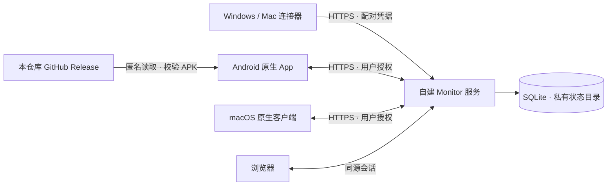

# Monitor

**在手机上，看到每台电脑的 AI 编程任务。**

Monitor 是面向个人部署的开源工作台，将多台 Windows / Mac 上的 Codex 与 Claude Code 任务汇总到原生 Android App、原生 macOS 客户端和浏览器。离开电脑后，可以查看进行中的任务、最终结果、附件和用量，并在已授权的会话中继续回复。

[下载 Android](https://github.com/Makabaka-zxh/agent-monitor/releases/latest) · [部署](docs/DEPLOYMENT.md) · [构建](docs/BUILDING.md) · [App 内更新](docs/UPDATES.md) · [English](README.en.md)

## 可以做什么

- **多电脑工作台**：按 Codex / Claude Code 筛选，区分进行中、需要关注和归档任务。
- **结果与附件**：查看最终答复，下载 TXT 和明确关联的配套文件；按设备授权结果同步和同会话回复。
- **用量与提醒**：查看可采集的当日 Token、每周趋势、会话用量、套餐窗口与重置倒计时。数据不可得时显示未知，不把它当成零。
- **原生 Android**：MiSans 字体、原生导航、扫码配对、账号资料、跟踪时长滚轮和“直至任务结束”。
- **实况内容自定义**：简洁／均衡／丰富预设，六项独立开关，Claude Code / Codex 的展开与锁屏预览。
- **App 内更新**：读取本仓库的正式 GitHub Release，显示说明与进度，校验安装包后交给 Android 确认安装。
- **自己掌握数据**：自建 Python 服务和本地 SQLite，不依赖作者的个人服务。Google 登录是可选功能，需要部署者自己的 OAuth 配置。

## 组成



连接器读取本机可用的会话与生命周期信息。账号、配对和同步权限由你自己的 Monitor 服务管理；Codex / Claude Code 的账号仍由各台电脑管理。

## 快速开始

需要 **Python 3.12+**。克隆仓库后在根目录运行：

```sh
python -m venv .venv
# macOS / Linux
source .venv/bin/activate
# Windows PowerShell: .venv\Scripts\Activate.ps1
python -m pip install -r requirements.txt
python -m agent_monitor
```

在运行服务的电脑上打开 `http://127.0.0.1:8766`，建立自己的 Monitor 账号。Windows 也可以使用根目录的 `start.cmd`。

手机使用需要正常验证证书的 HTTPS 地址。配置好反向代理后，按 [部署说明](docs/DEPLOYMENT.md) 启动服务，在 App 登录页填写该地址并完成浏览器确认。首次初始化保留在电脑本机进行。

在另一台电脑配对并先试用仅状态模式：

```sh
python -m agent_monitor.remote_agent pair-qr --server https://monitor.example.com --name "我的电脑"
python -m agent_monitor.remote_agent run --status-only
```

扫描二维码后需要确认连接。结果、文件和回复应按需要逐项开启；详见 [连接器说明](docs/CONNECTORS.md)。

## 1.0.0 的范围

这是项目的首个公开版本，不代表所有厂商和网络条件已经验收。Android 安装包需要 Android 8.0+；macOS 客户端源码需要 macOS 14+，本次不提供经过 Apple 公证的 Mac 安装包。iPhone 原生客户端尚未提供。

Android 更新是完整 APK 升级，需要系统安装确认，保留相同签名下的原有应用数据。项目不动态下载执行补丁，也不会静默安装。

三星、OPPO 和小米的系统实况入口按设备品牌呈现；实际支持受系统版本、权限与厂商接入条件限制。**小米官方超级岛／妙想背屏接入尚未完成平台授权**。App 内预览使用示例数据，不代表 OEM 系统卡片已经接入。OPPO 与三星适配代码保留，本版本没有覆盖所有机型。

早期真机测试出现过首请求较慢和连续 TLS / 超时，根因尚未完整定位。不要仅凭一次连接成功判断长期稳定性。配额来自工具可提供的数据，可能延迟或缺失；Token 统计不是账单证明。任务状态也受 CLI 版本、hooks 和后台进程生命周期影响。

## 仓库内容

| 目录 | 内容 |
| --- | --- |
| `agent_monitor/` | 服务、采集、配对、结果／回复、用量 |
| `web/` | 浏览器工作台和离线静态资源 |
| `android/` | 原生 Java Android App、测试和构建脚本 |
| `macos/` | SwiftUI 客户端及用户级连接器工具 |
| `tests/` | 使用合成数据的服务与采集测试 |
| `docs/` | 部署、构建、更新和项目说明 |

不包含作者的账号、数据库、服务地址、OAuth 密钥、应用签名私钥或私人测试日志。发布 ZIP 和 APK 校验值见 Release 的 `SHA256SUMS.txt`。

## 参与与许可

欢迎通过 [Issues](https://github.com/Makabaka-zxh/agent-monitor/issues) 报告可复现问题，或按 [贡献指南](CONTRIBUTING.md) 提交修改。涉及漏洞和敏感数据时请遵循 [安全说明](SECURITY.md)。

原创代码采用 [MIT](LICENSE)。**MiSans 字体、ZXing、jsQR 等资源各自遵循原许可**，详见 [第三方声明](THIRD_PARTY_NOTICES.md)。本应用使用 MiSans 字体，由小米提供。工具名称仅用于兼容性说明；项目与 OpenAI、Anthropic、小米、OPPO、三星无隶属或背书关系。
